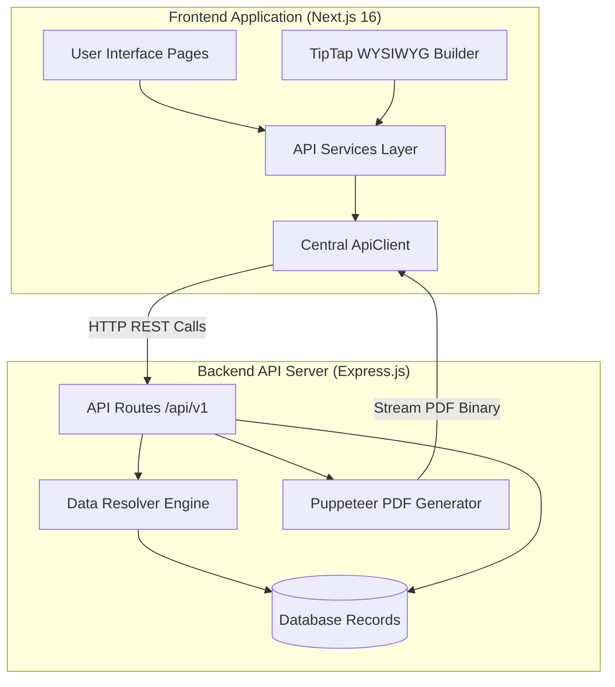
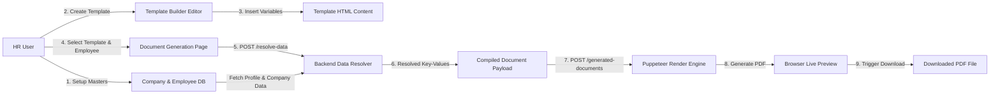
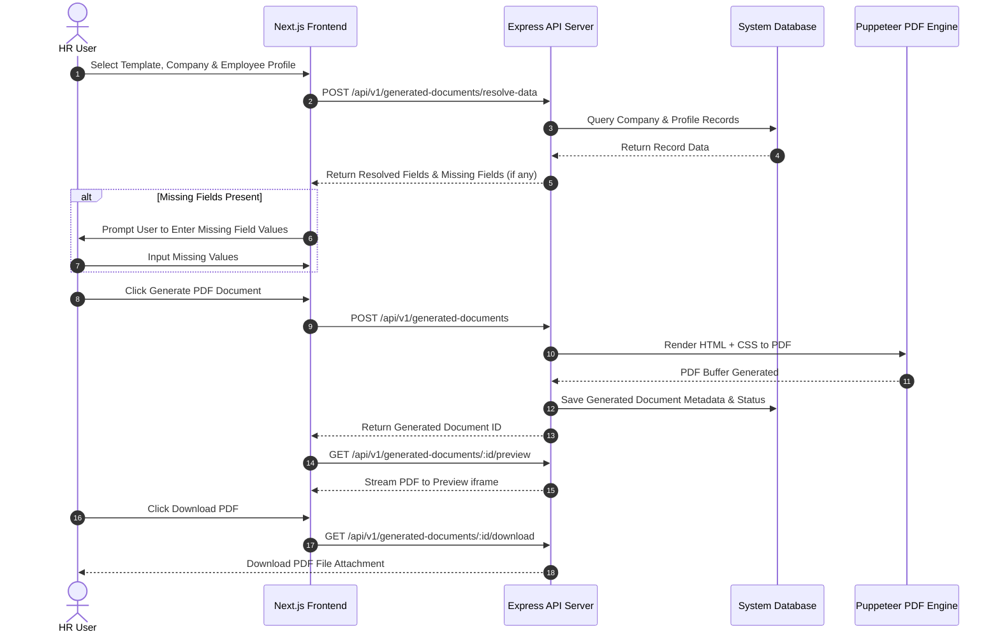

# HRMS Document Management and Generation System
## User Manual, System Architecture, and API Reference

---

## Table of Contents
1. System Overview
2. System Architecture and Data Flow Diagrams
   - System Architecture Diagram
   - End-to-End Data Flow Diagram
   - PDF Generation Sequence Diagram
3. System Modules
   - Company Management
   - Employee Profile Management
   - Document Types
   - Dynamic Fields
   - Template Master
   - Template Builder Editor
   - Document Import and Conversion
   - Document Generation Engine
4. Step-by-Step User Manual
   - Setting Up Master Data
   - Creating a Template
   - Generating and Downloading a PDF
5. API Reference Guide
   - Base Configuration
   - Complete Endpoint List
6. Setup and Running Instructions

---

## 1. System Overview

This web application helps HR teams generate employee documents such as Offer Letters, Experience Certificates, Relieving Letters, Appraisal Letters, and Non-Disclosure Agreements.

Instead of editing Word documents manually and replacing employee details one by one, this system stores company and employee details in a database. Templates are created once with dynamic variables such as employee name, designation, joining date, and salary. When generating a document, the system automatically replaces those variables with actual database values and creates a downloadable PDF.

### Main Stack
- Frontend: Next.js 16 (App Router), React 19, TypeScript, Tailwind CSS
- Visual Editor: TipTap WYSIWYG editor
- Icons: Lucide React
- Backend: REST API running on http://localhost:5000/api/v1 with Puppeteer PDF generation

---

## 2. System Architecture and Data Flow Diagrams

### System Architecture Diagram



---

### End-to-End Data Flow Diagram



---

### PDF Generation Sequence Diagram



---

## 3. System Modules

### 3.1 Company Management
- Route: /company
- Purpose: Stores company information such as Company Name, Code, Email, Address, GST number, and Logo.
- Usage: Dynamic fields like {{company_name}} and {{company_address}} pull data directly from the selected company record.

### 3.2 Employee Profile Management
- Route: /profile
- Purpose: Manages employee records including Employee Code, Name, Email, Phone, Designation, Department, Date of Joining, CTC, and Address.
- Usage: Serves as the primary source for dynamic variables when generating documents.

### 3.3 Document Types
- Route: /document-type
- Purpose: Categorizes documents into types such as Offer Letter, Experience Certificate, Relieving Letter, or NDA.
- Usage: Connects templates and dynamic fields to specific document categories for better organization.

### 3.4 Dynamic Fields
- Route: /dynamic-field
- Purpose: Defines placeholders that can be inserted into document templates.
- Key properties:
  - Field Name: Label shown to users (example: Employee Designation).
  - Field Key: Variable code placed in template text (example: employee_designation, inserted as {{employee_designation}}).
  - Category: Employee, Company, Custom, or System.
  - Data Type: Text, Number, Date, Dropdown, or Table.
  - Is Required: Whether the value must be present before generating the PDF.

### 3.5 Template Master
- Route: /template-master and /template-master/[id]
- Purpose: Manages saved template entries, their document types, and status.
- Usage: Allows creating new templates, opening the builder editor, or viewing imported document files.

### 3.6 Template Builder Editor
- Route: /template-builder/[templateId]
- Purpose: A rich text editor for designing document layouts visually.
- Key features:
  - Text formatting options including font size, font family, bold, italic, underline, alignment, and tables.
  - Sidebar listing available dynamic fields. Clicking a field inserts its variable tag at the cursor position.
  - Upload controls for header and footer images (letterhead banners).
  - Button to insert page break markers so multi-page documents print properly in PDF format.

### 3.7 Document Import and Conversion
- Route: /template-master/[id] detail view
- Purpose: Allows users to upload existing Word (.docx) or PDF (.pdf) files.
- Usage: The conversion endpoint converts uploaded Word files into HTML so they can be edited inside the Template Builder.

### 3.8 Document Generation Engine
- Route: /document-generation
- Purpose: The workflow page for creating final PDF files.
- Steps:
  1. Select a Template.
  2. Select Company and Employee Profile.
  3. The system resolves all field tags using database data.
  4. If required fields are missing, an input modal opens to collect the values.
  5. PDF generation is requested from the backend.
  6. The PDF is rendered in an inline preview and can be downloaded immediately.

---

## 4. Step-by-Step User Manual

### Setting Up Master Data

1. Create a Company Profile:
   - Go to Company Management (/company).
   - Click Add Company.
   - Enter Company Name, Code, Email, Address, GST, and upload a Logo.
   - Save the record.

2. Add Employee Records:
   - Go to Employee Profile Management (/profile).
   - Click Add Profile.
   - Enter Employee Code, Full Name, Email, Designation, Department, Joining Date, and CTC.
   - Save the record.

3. Create Dynamic Fields:
   - Go to Dynamic Fields (/dynamic-field).
   - Click Add Field.
   - Set Field Name to Employee Designation, Field Key to employee_designation, Category to Employee, and Data Type to Text.
   - Save the field.

### Creating a Template

1. Go to Template Master (/template-master) and click Create Template.
2. Enter a template name (example: Offer Letter - Software Engineer) and select the Document Type.
3. Click Open Template Builder.
4. Upload a Header image (company letterhead header) if required.
5. Type out the letter text in the editor.
6. Insert variables by clicking fields from the sidebar list (example: click employee_name to insert {{employee_name}}).
7. Upload a Footer image (signature or footer strip) if required.
8. Click Save Template.

### Generating and Downloading a PDF

1. Go to Document Generation (/document-generation).
2. Select the template (example: Offer Letter - Software Engineer).
3. Select the Company and Employee Profile.
4. Click Resolve Data. The system fills in variable values like name, designation, and salary automatically.
5. If any variable values are missing, enter them in the prompt screen.
6. Click Generate PDF.
7. Preview the document in the on-screen viewer and click Download PDF to save the file.

---

## 5. API Reference Guide

### Base Configuration
- Base URL: http://localhost:5000/api/v1 (configured in src/config/api.config.ts)
- Timeout: 10 seconds
- Headers: Content-Type: application/json for standard calls, multipart/form-data for file uploads.

### Complete Endpoint List

| No. | Endpoint URL | Method | Purpose | Frontend Service File | Request Payload | Response Data |
|---|---|---|---|---|---|---|
| 1 | /companies | GET | List all companies | company.service.ts | Query params: search, status | List of company records |
| 2 | /companies | POST | Create new company | company.service.ts | Company details JSON | Created company record |
| 3 | /companies/:id | GET | Get company by ID | company.service.ts | Route param: id | Company details |
| 4 | /companies/:id | PUT | Update company | company.service.ts | Route param: id, JSON body | Updated company record |
| 5 | /companies/:id | DELETE | Delete company | company.service.ts | Route param: id | Confirmation message |
| 6 | /companies/:id/status | PATCH | Update company status | company.service.ts | Route param: id, is_active JSON | Updated company record |
| 7 | /companies/bulk-delete | POST | Bulk delete companies | company.service.ts | JSON array of IDs | Confirmation message |
| 8 | /profiles | GET | List employee profiles | profile.service.ts | Query params: search, status | List of profile records |
| 9 | /profiles | POST | Create employee profile | profile.service.ts | Profile details JSON | Created profile record |
| 10 | /profiles/:id | GET | Get profile by ID | profile.service.ts | Route param: id | Profile details |
| 11 | /profiles/:id | PUT | Update employee profile | profile.service.ts | Route param: id, JSON body | Updated profile record |
| 12 | /profiles/:id | DELETE | Delete employee profile | profile.service.ts | Route param: id | Confirmation message |
| 13 | /profiles/bulk-delete | POST | Bulk delete profiles | profile.service.ts | JSON array of IDs | Confirmation message |
| 14 | /document-types | GET | List document types | documentType.service.ts | Query params: search, status | List of document types |
| 15 | /document-types | POST | Create document type | documentType.service.ts | Type details JSON | Created document type |
| 16 | /document-types/:id | GET | Get document type by ID | documentType.service.ts | Route param: id | Document type details |
| 17 | /document-types/:id | PUT | Update document type | documentType.service.ts | Route param: id, JSON body | Updated document type |
| 18 | /document-types/:id | DELETE | Delete document type | documentType.service.ts | Route param: id | Confirmation message |
| 19 | /dynamic-fields | GET | List dynamic fields | dynamicField.service.ts | Query params: category, docTypeId | List of dynamic fields |
| 20 | /dynamic-fields | POST | Create dynamic field | dynamicField.service.ts | Field details JSON | Created dynamic field |
| 21 | /dynamic-fields/document-type/:docTypeId | GET | Get fields by document type | dynamicField.service.ts | Route param: docTypeId | List of dynamic fields |
| 22 | /dynamic-fields/:id | PUT | Update dynamic field | dynamicField.service.ts | Route param: id, JSON body | Updated dynamic field |
| 23 | /dynamic-fields/:id | DELETE | Delete dynamic field | dynamicField.service.ts | Route param: id | Confirmation message |
| 24 | /template-masters | GET | List template masters | templateMaster.service.ts | Query params | List of templates |
| 25 | /template-masters | POST | Create template master | templateMaster.service.ts | Template details JSON | Created template |
| 26 | /template-masters/:id | GET | Get template master by ID | templateMaster.service.ts | Route param: id | Template details |
| 27 | /template-masters/:id | PUT | Update template master | templateMaster.service.ts | Route param: id, JSON body | Updated template |
| 28 | /template-masters/:id | DELETE | Delete template master | templateMaster.service.ts | Route param: id | Confirmation message |
| 29 | /template-contents/template/:templateId | GET | Get template editor content | templateBuilder.service.ts | Route param: templateId | HTML content record |
| 30 | /template-contents | POST | Save template editor content | templateBuilder.service.ts | HTML content JSON | Saved content record |
| 31 | /template-contents/:id | PUT | Update template content | templateBuilder.service.ts | Route param: id, JSON body | Updated content record |
| 32 | /template-contents/:id/upload | POST | Upload header/footer logo image | templateBuilder.service.ts | FormData: type, file | Updated content with image URL |
| 33 | /template-contents/:id/image | DELETE | Remove header/footer image | templateBuilder.service.ts | Route param: id, JSON: type | Updated content record |
| 34 | /template-documents/upload | POST | Upload Word or PDF document | templateDocument.service.ts | FormData: template_id, file | Uploaded document record |
| 35 | /template-documents/template/:templateId | GET | List imported documents | templateDocument.service.ts | Route param: templateId | List of uploaded files |
| 36 | /template-documents/:id/convert | POST | Convert document to HTML | templateDocument.service.ts | Route param: id | Converted document status |
| 37 | /template-documents/:id/original | GET | Download uploaded original file | templateDocument.service.ts | Route param: id | File binary download |
| 38 | /generated-documents/resolve-data | POST | Resolve values for dynamic fields | generatedDocument.service.ts | JSON: templateId, profileId, companyId | Resolved field data and missing fields |
| 39 | /generated-documents | POST | Generate PDF document | generatedDocument.service.ts | JSON: templateId, profileId, companyId, generatedData | Generated document record |
| 40 | /generated-documents | GET | List generated documents | generatedDocument.service.ts | Query params: templateId, status | List of generated documents |
| 41 | /generated-documents/:id | GET | Get generated document by ID | generatedDocument.service.ts | Route param: id | Generated document record |
| 42 | /generated-documents/:id/preview | GET | Stream PDF preview | generatedDocument.service.ts | Route param: id | PDF binary stream |
| 43 | /generated-documents/:id/download | GET | Download PDF file | generatedDocument.service.ts | Route param: id | PDF file attachment |
| 44 | /generated-documents/:id/regenerate | POST | Re-render PDF document | generatedDocument.service.ts | Route param: id | Regenerated document record |

---

## 6. Setup and Running Instructions

### Prerequisites
- Node.js version 18 or 20
- Backend REST API running on http://localhost:5000

### Environment Configuration
Create a .env.local file in the root folder with the following content:
```env
NEXT_PUBLIC_API_BASE_URL=http://localhost:5000/api/v1
```

### Running Development Server
Run this command in the terminal:
```bash
npm run dev
```
Open http://localhost:3000 in your browser.

### Building for Production
To build the application and package output files:
```bash
npm run build
```
This compiles the application and runs the export script to generate static output files inside the out folder.
